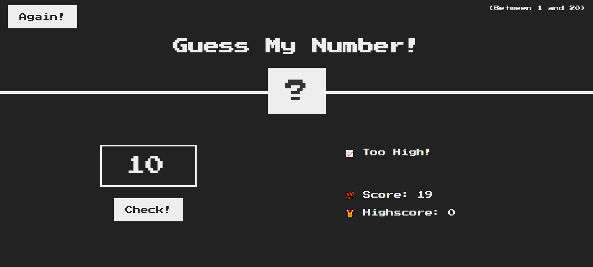

# guessTheNumber-JS
## _A simple guess the number web game built with Javascript focusing on DOM manipulation._

## Game Features

- Guess a number from 1-20
- Notify when guessed number is lower or higher
- Notify with red background when in put data is empty string
- There are 2 numbers. One is score that how faster one can predict number. Another is Highest Number
- Each wrong guess reduces one point where most chance number is 20
- Use again button without refreshing the page
- HTML/CSS DOM Manipulation with Vanilla JS

 
 

## Installation

cloning the git rep [https://github.com/aujisti-ador/guessTheNumber-JS.git]
or simply download a
